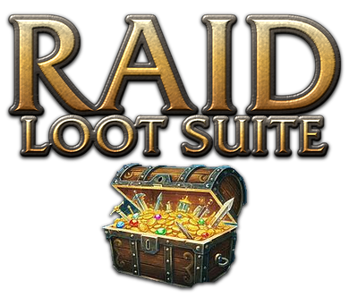

# Raid Loot Suite

**Loot history, soft reserves, SR / MS / OS rolls, loot council and raid loot tables.** For World of Warcraft 3.3.5a (Wrath of the Lich King).

Version 2.6.3 · by Saranwrap

---

## Installation

1. Close the game.
2. Download the zip (on GitHub: **Code → Download ZIP**) and open it.
3. Copy the **`RaidLootSuite`** folder into `<WoW folder>\Interface\AddOns\`. Keep its name: the addon loads from it.
4. Start the game.

**Updating:** close the game, **delete the old `RaidLootSuite` folder completely** (and any `Raid-loot-suite-main` folder from an older download, so only one copy is installed), then copy in the new one. Copying over the old folder can keep old files (images in particular), and the game only loads new files after a full restart, not after `/reload`.

## Quick start

- `/rls` opens or closes the window.
- Minimap button: left-click opens or closes the window, shift-click opens the History, right-click opens a menu.
- **Settings** is a button in the title bar (press **Back** to return).
- Try everything alone first: **Settings → Test mode** (fake raiders, nothing is sent to chat).

---

## The window

Tabs: **Loot Session**, **Soft Reserves**, **Loot Council**, **History** and **Loot Tables**.

- Drag the title bar to move the window, drag the bottom-right corner to resize it (double-click the corner for the default size).
- `/rls` opens the last tab you used.
- Hover any item in the game to see who soft reserved it.
- Most rows have a right-click menu with quick actions.

---

## Loot session

### Queue (left)

- As master looter, opening the boss corpse or chest adds its items to the queue and posts `Loot from <Boss>: [item] [item]…` in raid chat (both can be turned off in Settings).
- Add any item by hand: shift-click it into the box, or type its ID.
- Status of each item: Waiting, Rolling, Council vote, Tie, No rolls, Awarded, Delivered, Disenchant, Skipped. `SR: names` shows under soft reserved items.
- Right-click an item: roll, council, end roll, disenchant, skip, back to waiting, link in chat, remove, **Give to → Group 1-8 → player**.
- **Clear finished** removes the awarded, delivered, disenchanted and skipped items.

### Selected item (right)

| Button | |
| --- | --- |
| **Roll / Council** | Start a roll or a council vote |
| **End now** | End the roll and pick the winner |
| **Award** | Give it to the selected player (or right-click a player) |
| **Disenchant** | Give it to the disenchanter, saved as DE |
| **Skip / Remove** | Skip it, or remove it from the queue |
| **Roll timer** | Seconds for the next roll (5-120, default 10), or `/rls timer 30` |

### Rolls

- MS = `/roll 100`, OS = `/roll 99`, SR = `/roll 100`. Any MS roll beats any OS roll.
- Soft reserved by players in the raid: only they roll. One player reserved it: they get it.
- The timer ends the roll, with a 5-4-3-2-1 countdown in chat. The winner is announced and gets the item with Master Loot when the loot window is open.
- Ties reroll automatically between the tied players. Only the first roll of each player counts.
- Nobody rolled and a disenchanter is set: the item goes to the disenchanter.
- The status turns to Delivered when the winner receives the item.

### Raiders

- **With Raid Loot Suite**: a popup with MS / OS / Pass. The buttons do the `/roll` for them (also in a council vote), so everybody sees the rolls in chat.
- **Without it**: they read the raid chat and type `/roll 100` or `/roll 99` (council: whisper `ms`, `os` or `pass`, or roll). Their rolls count the same way.

### Loot council

- Raiders answer with the popup, a whisper (`ms` / `os` / `pass`) or a roll.
- Council members see the answers and click **Vote** (click again to take it back). Hover a player to see who voted for them. You select the player and press **Award**.
- Council members need Raid Loot Suite to vote.

---

## Soft reserves

- Views: **By item** (who reserved it, queue status or winner), **By player** (their reserves), **Edit list** (one line per reserve: click to edit, x to delete).
- Search box and "Only my raid" filter. Grey = not in your raid, (won) = already got it.
- Add: player + item (shift-click, item ID or exact name), then **Add**.
- Import: the softres.it CSV export (with or without its header line), or one reserve per line: `Player: [item]`, `Player - Item name`, `Player, 49623`.
- Players can whisper you: `sr [item]` (save), `sr` (check), `sr clear` (remove).
- **Announce** posts the list in raid chat, one line per item.

## Loot council members

Tick who can vote (you are always on it), add the leader and assists in one click, or add the name of someone not in the raid yet. Changes apply right away, also to a vote in progress.

---

## History

Records the item, boss, winner, date and time, raid and size / difficulty.

- Winners come from the `<player> receives loot` lines. Drops seen in the loot window show "Pending…" until someone loots them.
- By default: epic and better, inside raids, trash included. Emblems, Abyss Crystals and Frozen Orbs are ignored (Settings → History & window).
- Search, Raid and Period filters; click a column title to sort.
- Row: hover = tooltip, shift-click = link, ctrl-click = try on, right-click = edit winner / boss / note, mark as MS / OS / SR / DE, delete.
- Tag: left-click cycles none → MS → OS → SR → DE, right-click adds a note. Next to MS / OS, **LC** means the item was awarded by the loot council and **SR** that it went to a player who soft reserved it (set automatically, or from the right-click menu).
- **Delete…** (bottom right): delete part of the history without erasing it all. Choose what the filters show, a raid, a raid night (raid, size and date), a day, everything older than 7 / 14 / 30 / 60 / 90 / 180 / 365 days, pending drops (no winner), duplicates (the same drop recorded twice; the copy changed last is kept), test mode entries, or everything. Each choice shows how many entries it deletes and asks first. A sync does not bring deleted drops back.
- **Sync column** (tick box at the start of each row, ticked by default): untick a drop to keep it out of syncs; it stays only in your history.
- **Sync** gets the loot other raid members recorded in the last 7 days and fills in what you missed (disconnected, too far away). They need Raid Loot Suite. **Auto sync** also runs it once after a login, a `/reload` or when you join a raid; turn it off in Settings → History & window. A drop someone changed (winner, MS / OS, LC / SR, note, boss) is recognised as the same drop and not added twice; the most recent change wins (both players need 2.6.1 or later for a changed winner to be recognised).
- **Export**: CSV (Excel / Google Sheets), plain text or Discord (what is shown; the filters apply), with how each item was awarded (LC / SR).
- **Import**: Excel / Google Sheets cells with the header row, CSV, this addon's exports, or lines like `Item -> Player` / `Boss | Item -> Player MS`.
- Outside the game: `Tools\savedvariables_to_csv.py` makes a CSV from the saved file (Python 3).

---

## Loot tables

Every raid boss with its loot in 10 / 25 (and 10 / 25 heroic where the raid has it), plus **Trash mobs** (epics and better) and **Patterns & recipes**.

- Each item: type, item level and drop chance. **HM** = hard mode only. **A** (blue) / **H** (red) = Alliance / Horde only.
- Click a column title to sort (again to reverse).
- Search box: an item or a type ("trinket", "plate", "pattern") in the whole raid.
- Right-click an item: link it, add it to the loot queue, add a soft reserve.

Drop chances come from the AzerothCore world database (the core ChromieCraft runs on). A server can change its loot, so treat them as a guide.

---

## Settings

- **Loot session**: test mode, roll timer, announce channels (roll start, winners, countdown), auto-queue, post boss loot in raid chat, give with Master Loot, countdown, whisper SR, whisper MS / OS, disenchanter (and give no-roll items to the disenchanter), council members.
- **History & window**: minimum quality, raids only, trash drops, chat line when loot is recorded, minimap button, auto sync, window opacity, links.

Raid warning needs leader or assist; otherwise raid chat is used.

## Test mode

Settings, the minimap menu or `/rls test`. Six fake raiders, a few test items from your gear and ready-made soft reserves. Fake raiders roll, answer the council and vote. "Fake whisper" in Soft Reserves tests the whisper commands. Nothing is sent to chat and Master Loot is not used. Awards go into the history as "Test Boss" (you are asked whether to keep them when the test stops).

---

## Commands

| Command | |
| --- | --- |
| `/rls` | Open or close the window (`/raidloot` works too) |
| `/rls session` · `sr` · `council` · `history` · `tables` | Open a tab |
| `/rls queue [item]` | Add an item to the loot queue |
| `/rls timer <seconds>` | Roll timer (5-120) |
| `/rls sync` | Get the loot history recorded by the raid |
| `/rls export` · `import` | Export or import the history |
| `/rls options` | Settings |
| `/rls add [item] Player [MS\|OS] Boss` | Add a history entry by hand |
| `/rls minimap` | Show or hide the minimap button |
| `/rls test` | Test mode on or off |
| `/rls testentry` | Add a sample entry to the history |
| `/rls delete` | Delete part of the history (by raid, raid night, day, age…) |
| `/rls clear` | Delete all the history |
| `/rls help` | List the commands in chat |

## Saved data

`WTF\Account\<ACCOUNT>\SavedVariables\RaidLootSuite.lua`, shared by your characters. It is written on logout, `/reload` or exit, so a crash loses that session's changes. A roll or vote in progress does not survive a `/reload`.

## Links

- GitHub: https://github.com/saranwrap04/Raid-loot-suite
- Warperia: https://warperia.com/addon-wotlk/raid-loot-suite/

---

## Screenshots

<b>Loot session</b>

<b>Right-click menu in the loot queue</b>

<b>Raider popups: soft reserve roll and MS / OS roll</b>

<b>Soft reserves</b>

<b>Loot council members</b>

<b>History</b>

<b>Loot tables</b>

<b>Settings: loot session</b>

<b>Settings: history and window</b>

